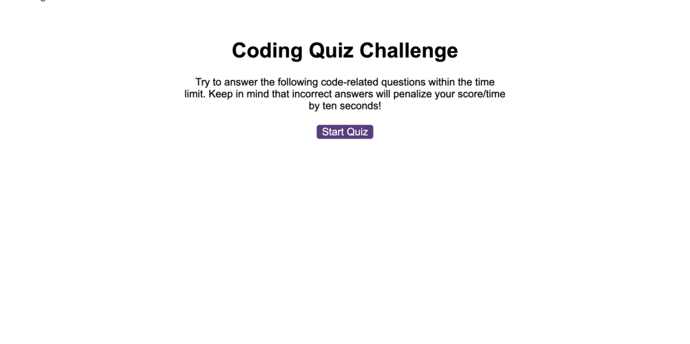

# JavaScript-Quiz

## Description

This project was designed to test out various new skills learnt in javaScript. The task was to create a quiz that used dynamic javaScript, along with local storage to store users scores and display them. This was the most challenging assignment i have had so far as many of the things needed were covered very wuickly this week. There was alot of trial and error with how the syntax should be written inorder to make certain functions work, especially with the use of local storage.

## Usage

When the user clicks on the start button the 1st question is displayed and the timer starts to countdown. When an answer is clicked the next question is displayed, and depending on if the answer was right or wrong, the user will recieve a score and time deduction or increase. This repeats until either the time exspires or all the quetions are answered.
At this point a new screen is displayed showing their final score and requesting their initials. Both of these items of data are stored in local storage and the screen then navigates to the highscores list, where all the scores stored in the local storage are displayed from highest to lowest. There is also a button allowing the user to clear the stored scores.

Here is a link to the deployed page:
https://harryunderscore13.github.io/JavaScript-Quiz/

Below is a gif of the page in actions:

